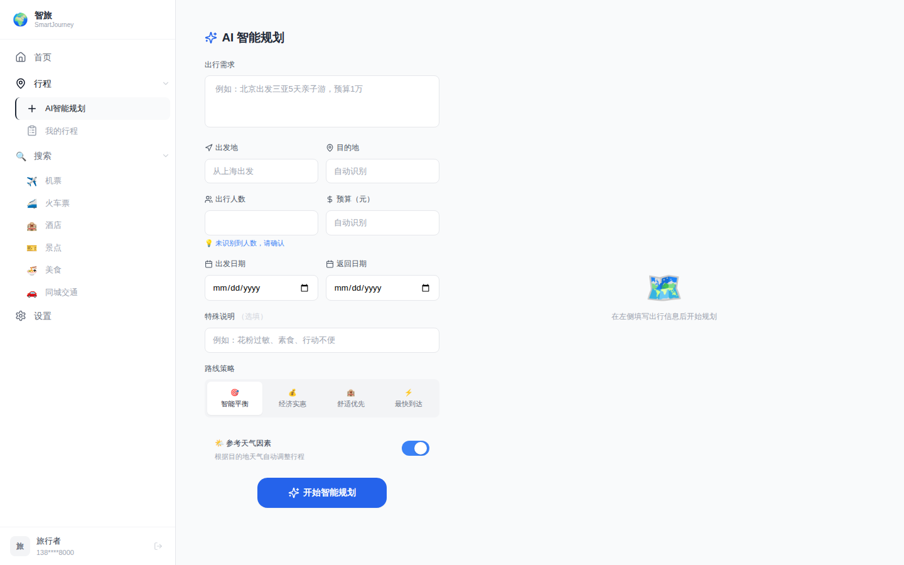
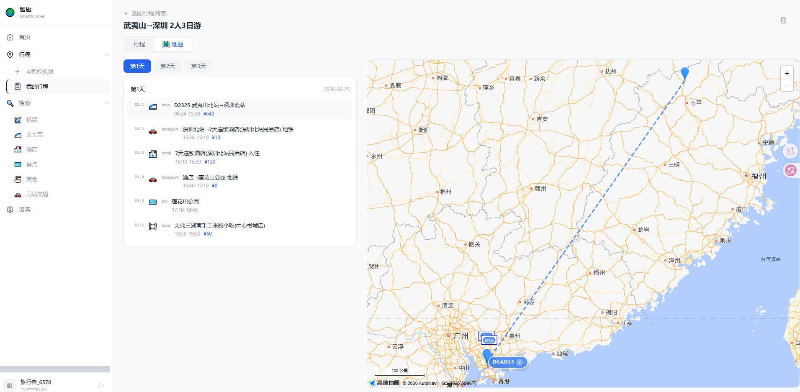

# SmartJourney（智旅）

AI 驱动的智能旅行规划平台，移动端 + PC Web 双版本。

## 功能截图

<table>
<tr>
  <td align="center"><b>移动端</b></td>
  <td align="center"><b>PC 端</b></td>
</tr>
<tr>
  <td></td>
  <td></td>
</tr>
<tr>
  <td align="center">AI 智能规划</td>
  <td align="center">AI 智能规划</td>
</tr>
<tr>
  <td></td>
  <td></td>
</tr>
<tr>
  <td align="center">AI 规划进行中</td>
  <td align="center">AI 规划进行中</td>
</tr>
<tr>
  <td></td>
  <td></td>
</tr>
<tr>
  <td align="center">行程详情 - 地图</td>
  <td align="center">行程详情 - 地图</td>
</tr>
<tr>
  <td></td>
  <td></td>
</tr>
<tr>
  <td align="center">行程详情 - 行程</td>
  <td align="center">行程详情 - 行程</td>
</tr>
</table>

## 技术栈

| 层 | 技术 |
|---|------|
| 前端 | React 18 + TypeScript + Vite + TailwindCSS + Zustand |
| 后端 | FastAPI + SQLAlchemy 2.0 async + PostgreSQL + Redis |
| AI | DeepSeek / OpenAI-compatible LLM + MCP 网关 |
| 地图 | 高德 JS API 2.0 + Web 服务 API |

## 快速开始

### 前置准备

| 平台 | 配置项 | 获取方式 | .env 对应字段 |
|------|--------|---------|-------------|
| DeepSeek | API Key | [platform.deepseek.com](https://platform.deepseek.com) → API Keys | `LLM_API_KEY` |
| 高德地图 | Web 服务 Key + JS API Key | [console.amap.com](https://console.amap.com) → 应用管理 | `GAODE_API_KEY` |
| ModelScope | MCP 飞猪旅行实例 URL | [modelscope.cn](https://modelscope.cn) → MCP 服务 | `MCP_FLIGGY_URL` |
| 飞猪 FlyAI | API Key + Sign Secret | 飞猪开放平台 | `FLYAI_API_KEY` / `FLYAI_SIGN_SECRET` |
| 短信 | AccessKey + 签名 + 模板 | 阿里云短信控制台（开发环境可用 `mock` 跳过） | `SMS_*` |

```bash
# 1. 依赖服务
docker compose up -d postgres redis

# 2. 后端
cd backend
cp .env.example .env          # 按上表填入三方配置
python -m venv .venv && source .venv/bin/activate
pip install -r requirements.txt
uvicorn app.main:app --host 0.0.0.0 --port 8000 --loop asyncio

# 3. 前端
cd frontend
npm install
npm run dev                   # 移动端 :5173 / PC端 :5173/pc.html
```

### 多 Worker 启动（生产/高并发）

单 worker 适合开发调试，生产环境推荐多 worker 提升并发能力：

```bash
# 1. .env 中关闭内嵌定时任务
DISABLE_EXPIRY_TASK=true

# 2. 主服务 — 4 worker（根据 CPU 核心数调整 --workers）
uvicorn app.main:app --host 0.0.0.0 --port 8000 --loop asyncio --workers 4

# 3. 定时任务守护 — 独立单进程执行行程过期检查
python scripts/expiry_daemon.py &
```

| 平台 | 守护进程管理方式 |
|------|----------------|
| WSL / Linux | `systemd --user` 或 `nohup python scripts/expiry_daemon.py &` |
| Windows | `pythonw scripts/expiry_daemon.py`（无窗口后台）或注册 Windows Service |
| Docker | 同一镜像两个容器：`app --workers 4` + `app-expiry`（CMD 指向 expiry_daemon.py） |

**原理**：FastAPI 多 worker 模式下，每个 worker 独立运行 `lifespan` 中的后台任务。
若不剥离，N 个 worker 会同时执行行程过期检查（SQL UPDATE 幂等所以数据安全，但浪费资源）。
设置 `DISABLE_EXPIRY_TASK=true` 后主服务跳过定时任务，由 `expiry_daemon.py` 单独运行。

## 部署

```bash
docker compose up -d                    # 全栈部署
docker compose up -d --build backend    # 仅重建后端
docker compose logs -f backend          # 查看日志
```

Nginx 配置：`nginx.conf`（反向代理 + 静态文件 + SSE 长连接）

## 项目结构

```
backend/
├── app/
│   ├── api/            # FastAPI 路由
│   │   ├── auth.py     # 手机号登录
│   │   ├── trips.py    # 行程 CRUD
│   │   ├── plan.py     # AI 规划（SSE 流式）
│   │   ├── map_routes.py # 地图 API
│   │   └── search.py   # 搜索
│   ├── models/         # SQLAlchemy ORM
│   ├── services/       # 业务逻辑
│   │   ├── agent_service.py   # AI 规划 Agent + 坐标 geocode
│   │   ├── trip_service.py    # 行程 CRUD
│   │   ├── trip_expiry.py     # 过期标记
│   │   ├── mcp_manager.py     # MCP 连接池
│   │   ├── mcp_gateway.py     # MCP 多 Server 网关
│   │   └── map_service.py     # 高德 geocode + POI
│   ├── config.py       # .env 配置类
│   └── database.py     # async session
├── config.json         # 运行时配置（策略、别名、停运站）
├── scripts/
│   └── expiry_daemon.py  # 行程过期守护进程（多 worker 模式配套）
├── migrations/         # SQL 迁移脚本
├── tests/
└── .env.example

frontend/
├── src/
│   ├── pages/          # 移动端页面
│   ├── pc/             # PC 端页面
│   ├── components/     # 共享组件（TripMap, TripTimeline...）
│   ├── stores/         # Zustand 状态管理
│   └── api/            # HTTP 客户端 + SSE
├── index.html          # 移动端入口
└── pc.html             # PC 端入口
```
